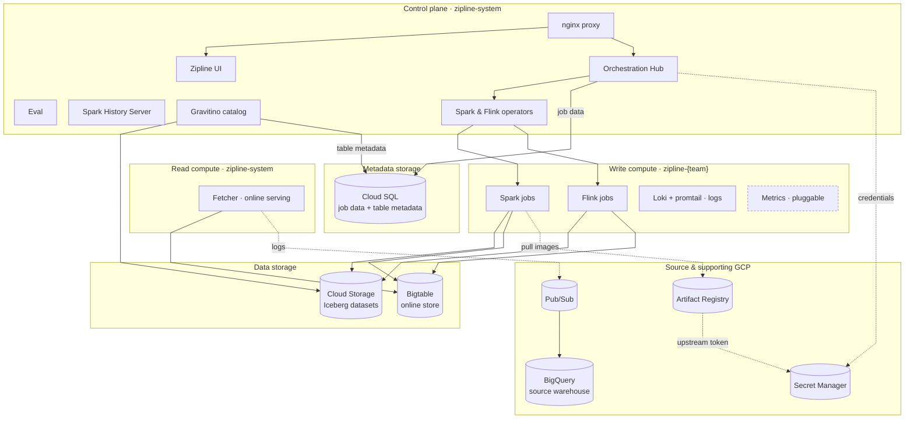
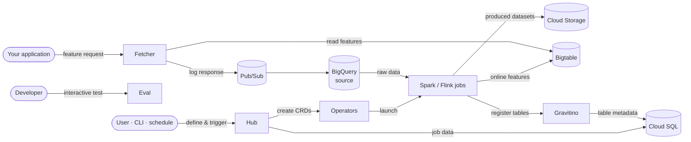

# Working with Zipline: GCP Deployment

This document describes how **Zipline Enterprise** deploys on **Google Cloud (GCP)**. As with
every Zipline engagement, the deployment is **BYOC (Bring Your Own Cloud)** — the Zipline control
plane and all compute run inside *your own* GCP project and VPC, complementing the open-source
Chronon engine. Your data never leaves your environment.

Access from your users is fronted by an **Identity-Aware Proxy (IAP)**, so only people you
authorize can reach the Hub UI.

## Infrastructure footprint

A Zipline deployment on GCP organizes into a few functional layers, all running in your project:

| Layer | Components | Runs on / uses (GCP) |
|---|---|---|
| **Control plane** | Hub, UI, Eval, Gravitino catalog, Spark/Flink operators | GKE — `zipline-system` |
| **Write compute** | Spark (batch) & Flink (streaming) jobs, Loki (logs); metrics pluggable | GKE — `zipline-<team>` |
| **Read compute** | Fetcher (online feature serving) | GKE — `zipline-system` |
| **Data storage** | Iceberg datasets (Cloud Storage), online store (Bigtable) | GCS, Bigtable |
| **Metadata storage** | Job data (Hub) + table metadata (Gravitino) | Cloud SQL |
| **Source & supporting** | Source warehouse (BigQuery), feature logging (Pub/Sub), images (Artifact Registry), credentials (Secret Manager) | — |

## System layout

How the components are organized and what each connects to.

**Notes:**

- **Everything runs in your project** on a private VPC; your data stays in your environment.
- **Control plane and read compute** run in `zipline-system`; **write compute** runs in one
  namespace per team (`zipline-<team>`).
- **Metrics are pluggable** — Loki handles logs in-cluster; metrics can flow to VictoriaMetrics,
  Google Cloud Monitoring, or your own backend.
- **No static keys** — in-cluster workloads access GCP services via **Workload Identity**.

## Control flow

How a feature pipeline runs and how features are served.

**Notes:**

- **Write path:** a user defines features and triggers them (ad-hoc via the Zipline CLI, or
  scheduled from repo configs). The Hub creates Spark/Flink CRDs; operators launch the jobs;
  jobs read raw source data from **BigQuery**, write produced **Iceberg** datasets to **Cloud
  Storage** (registered in **Gravitino**), and write online features to **Bigtable**.
- **Read path:** your application requests features from the **Fetcher**, which reads from
  **Bigtable** and logs served responses through **Pub/Sub → BigQuery**.
- **Eval** lets developers validate a job's semantics interactively, with no compute usage.
- **Zipline → Chronon:** the Hub submits scripts to the Chronon engine via the open-source API.

## Components

Components run as Kubernetes workloads on GKE (control plane + compute) plus GCP managed
services. Namespaces are flat: control plane and read compute in `zipline-system`, and one
write-compute namespace per team (`zipline-<team>`, starting with `zipline-default`).

### Control plane

| Component | What it does |
|---|---|
| **Orchestration Hub** | Schedules feature pipelines, submits and monitors Spark/Flink jobs, proxies the Spark/Flink/History UIs, and stores job data in Cloud SQL. |
| **Eval** | Dev server for interactive testing — quickly validate a job's semantics as you author it. |
| **Gravitino** | Zipline's warehouse catalog — registers Zipline-produced Iceberg datasets (on Cloud Storage) and stores their table metadata in Cloud SQL. |
| **Zipline UI** | The web interface for defining and monitoring features (behind the nginx proxy with the Hub). |
| **Spark History Server** | Post-run Spark UI — inspect completed jobs, stages, and logs. |
| **Spark & Flink operators** | Turn job submissions into running Spark/Flink pods. |

### Write compute (`zipline-<team>`)

| Component | What it does |
|---|---|
| **Spark jobs** | Batch feature computation (driver + autoscaling executors). |
| **Flink jobs** | Streaming feature computation (JobManager + TaskManagers). |
| **Loki + promtail** | Collect and store job logs inside the cluster. |
| **Metrics** | Pluggable — VictoriaMetrics, Google Cloud Monitoring, or your own backend. |

Compute scales elastically — you don't size clusters or pick machine types. Jobs scale up on
demand and release nodes when idle, using spot/preemptible capacity where appropriate.

### Read compute

| Component | What it does |
|---|---|
| **Fetcher** | Serves features online — reads from the Bigtable online store and returns features to your applications; logs served responses to Pub/Sub → BigQuery. |

### Data storage

| Service | What Zipline uses it for |
|---|---|
| **Cloud Storage (GCS)** | Zipline-produced datasets (Iceberg tables, cataloged by Gravitino), plus Spark event logs, Flink checkpoints, and artifacts. |
| **Bigtable** | Low-latency online store (KV Store) for serving features. |

### Metadata storage

| Service | What Zipline uses it for |
|---|---|
| **Cloud SQL** | Platform metadata — the Hub's **job data** and Gravitino's **table metadata**. Credentials are read from Secret Manager. |

### Source & supporting services

| Service | What Zipline uses it for |
|---|---|
| **BigQuery** | Your **source warehouse** — Spark reads the customer's native raw business data from here. Also the destination for logged features. |
| **Pub/Sub** | Streams logged feature-serving responses into BigQuery. |
| **Artifact Registry** | Hosts the platform's container images; mirrors upstream images using a token in Secret Manager. |
| **Secret Manager** | Holds credentials — the Cloud SQL password and the image-mirror token. |

## Multi-team isolation

Compute namespaces map to your **team-level configurations**: the install starts with
`zipline-default`, and additional per-team namespaces (`zipline-<team>`) are added as teams are
defined. Each namespace has its own **resource quotas**, giving every team an isolated compute
boundary.

## Network & security

- **Everything runs in your VPC.** The platform deploys into your GCP project on a private
  VPC and subnet. Your data stays in your project.
- **Private connectivity.** Cloud SQL and Bigtable are reached over **Private Services Access**
  (private IPs), not the public internet.
- **Egress only.** Outbound traffic (e.g., pulling container images) goes through **Cloud NAT**;
  there are no public ingress paths to your data services.
- **Authenticated access.** Your users reach the UI through an **Identity-Aware Proxy**, so
  access is gated by your Google identity / group membership.
- **No static keys.** In-cluster workloads authenticate to GCP services via **Workload
  Identity**, eliminating long-lived service-account keys.
