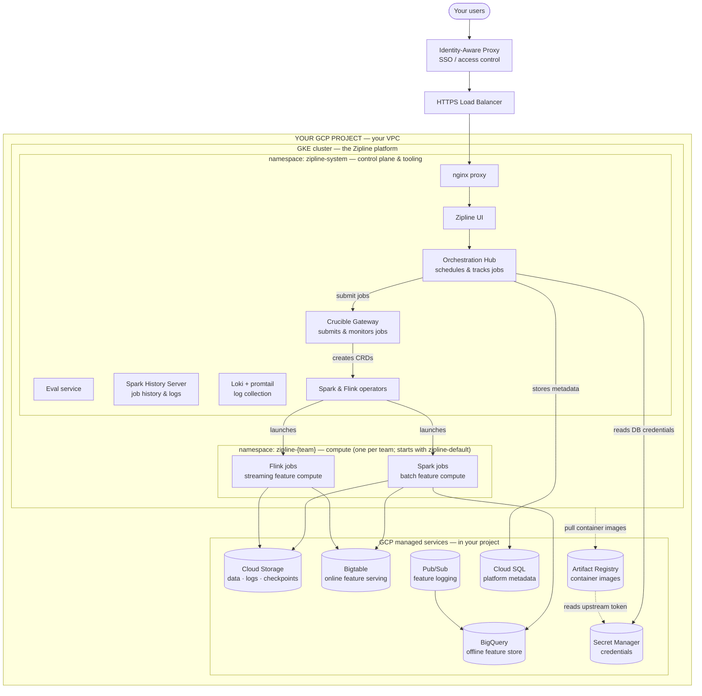

# Zipline on GCP — What Gets Installed

This document describes what the Zipline platform installs into **your own GCP project**.
Zipline is deployed **BYOC (Bring Your Own Cloud)**: every component below runs inside your
project and your VPC, and your data never leaves your environment. The platform is two things:

1. A **GKE cluster** that runs the Zipline application and your Spark/Flink compute, and
2. A set of **GCP managed services** (Cloud Storage, BigQuery, Bigtable, etc.) that Zipline
   uses for storage, serving, and credentials.

Access from your users is fronted by an **Identity-Aware Proxy (IAP)**, so only people you
authorize can reach the UI.

## Diagram

## What runs in the GKE cluster

The Zipline application and all compute run as Kubernetes workloads. Namespaces are flat: one
shared **control-plane** namespace (`zipline-system`) plus one **compute namespace per team**
(starting with `zipline-default`). See [Multi-team isolation](#multi-team-isolation--resource-governance)
for how team namespaces are provisioned.

### `zipline-system` — control plane & tooling

| Component | What it does |
|---|---|
| **Zipline UI** | The web interface your team uses to define and monitor features. |
| **Orchestration Hub** | Schedules feature pipelines, tracks job history, and drives the UI. |
| **Crucible Gateway** | Submits and monitors Spark/Flink jobs; proxies the Spark/Flink/History UIs. |
| **Spark History Server** | Post-run Spark UI — inspect completed jobs, stages, and logs. |
| **Eval** | Runs feature evaluation / validation workloads. |
| **Loki + promtail** | Collects and stores job and platform logs inside the cluster. |
| **Spark & Flink operators** | Turn job submissions into running Spark/Flink pods. |

The UI and Hub sit behind a single **nginx proxy**, so there's one entry point for the platform.

### `zipline-<team>` — compute (one per team)

| Component | What it does |
|---|---|
| **Spark jobs** | Batch feature computation (driver + autoscaling executors). |
| **Flink jobs** | Streaming feature computation (JobManager + TaskManagers). |

Compute scales elastically — you don't size clusters or pick machine types. Jobs scale up on
demand and release nodes when idle, using spot/preemptible capacity where appropriate.

## Multi-team isolation

Compute namespaces map to your **team-level configurations**: the install starts with
`zipline-default`, and additional per-team namespaces (`zipline-<team>`) are added as teams are
defined. Each namespace has its own **resource quotas**, giving every team an isolated compute
boundary.

## GCP managed services Zipline uses

All of these live in **your** project. Zipline accesses them using **Workload Identity** — pods
are granted access through GCP service accounts, so there are **no static keys** to manage.

| Service | What Zipline uses it for |
|---|---|
| **Cloud Storage (GCS)** | Stores your data, Spark event logs, Flink checkpoints, and artifacts. |
| **BigQuery** | Offline feature store / warehouse, and the destination for logged features. |
| **Bigtable** | Low-latency online store for serving features to your applications. |
| **Pub/Sub** | Streams logged feature-serving responses into BigQuery. |
| **Cloud SQL** | Stores platform metadata (the Hub's job index). The Hub reads its DB credentials from Secret Manager. |
| **Artifact Registry** | Hosts the platform's container images. Mirrors upstream images using a token stored in Secret Manager. |
| **Secret Manager** | Holds credentials — the Cloud SQL password and the image-mirror token. |

## Network & security

- **Everything runs in your VPC.** The platform deploys into your GCP project on a private
  VPC and subnet. Your data stays in your project.
- **Private connectivity.** Cloud SQL and Bigtable are reached over **Private Services Access**
  (private IPs), not the public internet.
- **Egress only.** Outbound traffic (e.g., pulling container images) goes through **Cloud NAT**;
  there are no public ingress paths to your data services.
- **Authenticated access.** Your users reach the UI through an **Identity-Aware Proxy**, so
  access is gated by your Google identity / group membership.
- **No static keys.** In-cluster workloads authenticate to GCP services via **Workload
  Identity**, eliminating long-lived service-account keys.
