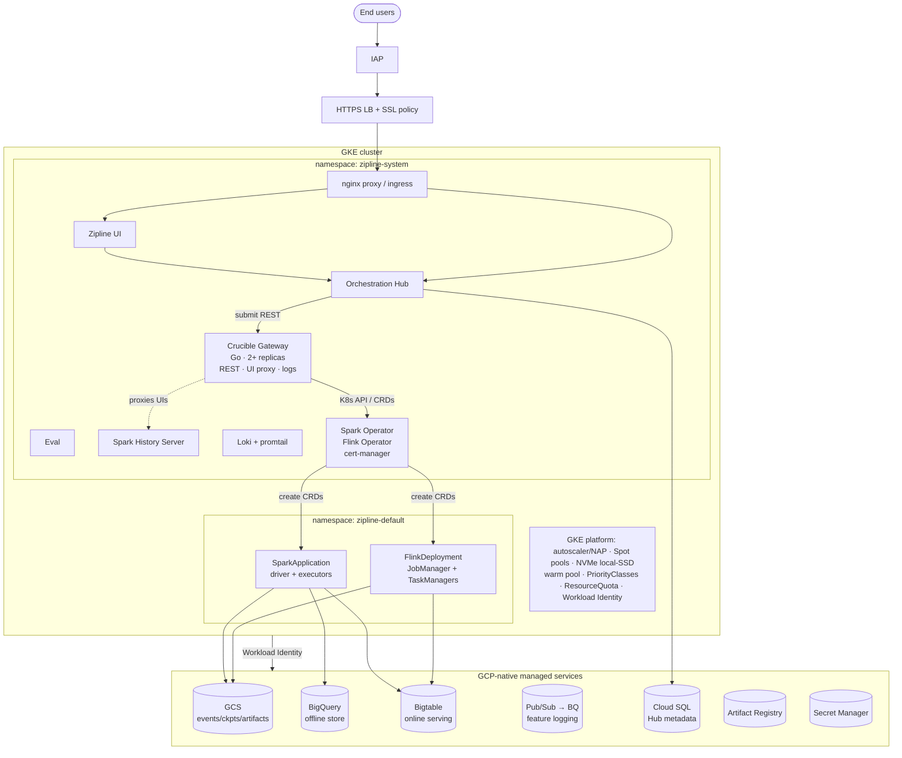

# Zipline on GCP — Crucible Architecture

> **Status: target-state.** As of this writing, `infra-gcp-prod` (origin `main`) still
> deploys the **Cloud Run + Dataproc** model. This document describes the **crucible**
> (Kubernetes-native) deployment on **GKE**, mirroring the AWS crucible deployment with
> GCP-native managed services underneath. The crucible Helm chart already defaults to
> `cloudProvider: gcp` but has no `values-gke.yaml` overlay yet (only `values-eks.yaml`
> and `values-aks.yaml`).

## Overview

Hub + UI and Spark/Flink compute all run on **GKE**, split across two namespaces:

- **`zipline-system`** — control plane + observability: Hub + UI behind an nginx proxy,
  Crucible gateway, Spark History Server, Eval, Loki + promtail, and the Spark/Flink
  operators.
- **`zipline-default`** — compute: Spark (driver + executors) and Flink
  (JobManager + TaskManagers) job pods, created as CRDs by the operators.

State is split by lifecycle: K8s owns live job state, Spark History Server owns Spark
post-mortem UI metadata, Flink owns runtime/checkpoint state, and the **Orchestration
Hub owns the durable job index in Cloud SQL**. The crucible gateway itself is stateless
(no gateway database).

## Diagram (ASCII)

```
                        ┌─────────────┐
   End users ──────────▶│     IAP     │─────▶ HTTPS LB + SSL policy
   (user_email group)   └─────────────┘              │
╔════════════════════════════════════════════════════╪═══════════════════════════════════════╗
║  GKE CLUSTER                                         │                                       ║
║                                          ┌───────────┴───────────┐                           ║
║  ┌── namespace: zipline-system ──────────┤   nginx proxy/ingress  ├──────────────────────┐   ║
║  │                                       └───────────┬───────────┘                       │   ║
║  │   ┌──────────┐   ┌──────────────┐                 │                                    │   ║
║  │   │ Zipline  │   │ Orchestration│◀────────────────┘                                    │   ║
║  │   │   UI     │──▶│     Hub      │──────────┐ submit jobs (REST)                         │   ║
║  │   └──────────┘   └──────┬───────┘          ▼                                            │   ║
║  │                         │          ┌────────────────────────────────┐                  │   ║
║  │   ┌──────────┐          │          │  Crucible Gateway (Go, 2+ rep.) │                  │   ║
║  │   │   Eval   │          │          │  REST · UI proxy · log stream   │                  │   ║
║  │   └──────────┘          │          └───┬───────────────┬────────────┘                  │   ║
║  │   ┌──────────┐  ┌───────┴────────┐     │ K8s API/CRDs  │ svc proxy / pod logs           │   ║
║  │   │ Spark    │  │ Loki + promtail│     │               │                                │   ║
║  │   │ History  │  │   (logs)       │     ▼               ▼                                │   ║
║  │   │ Server   │  └────────────────┘ ┌─────────────┐  (proxies Spark/Flink/SHS UIs)       │   ║
║  │   └──────────┘                     │ Spark Op.   │                                      │   ║
║  │                                    │ Flink Op.   │  create CRDs                          │   ║
║  └────────────────────────────────────┤ (cert-mgr) │──────────────┐                       │   ║
║                                        └─────────────┘              │                       │   ║
║  ┌── namespace: zipline-default (compute) ───────────────────────── ▼ ───────────────────┐ │   ║
║  │   SparkApplication → driver + executors (dynamic allocation)                           │ │   ║
║  │   FlinkDeployment  → JobManager + TaskManagers (application mode)                       │ │   ║
║  └────────────────────────────────────────────────────────────────────────────────────── ┘ │   ║
║                                                                                              │   ║
║  GKE platform: autoscaler/NAP · Spot pools · NVMe local-SSD shuffle · warm pool             │   ║
║               · PriorityClasses · ResourceQuota/LimitRange · Workload Identity ─────────────┘   ║
╚══════════════════════════════════════╪══════════════════════════════════════════════════════════╝
                                        │  Workload Identity → GCP service accounts
   ┌──────────┬──────────────┬──────────┴───┬──────────────┬───────────────┬──────────────┐
   ▼          ▼              ▼              ▼              ▼               ▼              ▼
┌────────┐┌──────────┐ ┌───────────┐ ┌──────────┐ ┌────────────┐ ┌──────────────┐ ┌──────────┐
│  GCS   ││ BigQuery │ │ Bigtable  │ │ Pub/Sub  │ │ Cloud SQL  │ │  Artifact    │ │  Secret  │
│events/ ││ offline  │ │ online    │ │ feature  │ │ Hub        │ │  Registry    │ │ Manager  │
│ckpts/  ││ store    │ │ serving   │ │ logging  │ │ metadata   │ │ images       │ │          │
│artifacts│└──────────┘ └───────────┘ │  → BQ    │ └────────────┘ └──────────────┘ └──────────┘
└────────┘             └──────────┘
  Networking: VPC + subnet · Cloud Router + Cloud NAT · firewall · Private Services Access · IAP
```

## Diagram (Mermaid)



## Component inventory

### A. GKE in-cluster workloads

| Plane | Component | K8s form | Source |
|---|---|---|---|
| Orchestration (`zipline-system`) | Zipline UI, Orchestration Hub, Eval | Deployments + Services behind nginx ingress | orchestration chart (port from AWS `zipline-orchestration`) |
| Gateway (`zipline-system`) | Crucible Gateway (Go, stateless, 2+ replicas) | Deployment + Service + Ingress | `crucible` chart |
| Compute operators (`zipline-system`) | Kubeflow Spark Operator (Spark 4.1), Apache Flink K8s Operator (Flink 2.x), KubeRay Operator (optional) | Helm sub-charts | `crucible` Chart.yaml deps |
| Compute jobs (`zipline-default`) | SparkApplication (driver + executors, dynamic allocation), FlinkDeployment (JM + TM, application mode), RayJob (optional) | CRDs → pods | gateway-created |
| Job UIs (`zipline-system`) | Spark History Server, Ray History Server (optional) | Deployment + PVC + Service + Ingress | `crucible` chart |
| Observability (`zipline-system`) | Loki + promtail, VictoriaMetrics, cert-manager (Flink prereq) | Deployments/DaemonSet | `crucible` chart |

### B. GKE platform primitives

Cluster autoscaler / Node Auto-Provisioning · Spot node pools (`cloud.google.com/gke-spot`) ·
NVMe local-SSD shuffle (nvme-daemonset: discover/format/mount/taint) · warm pool (sub-20s
driver startup) · PriorityClasses (`crucible-system` 1000 / `crucible-driver` 100 /
`crucible-pause`) · ResourceQuota + LimitRange · image-prepull daemonset · Workload Identity.

### C. GCP-native managed services (BYOC, outside the cluster)

| Service | Role |
|---|---|
| GCS | object store — Spark event logs (`gs://…/spark-events`), Flink checkpoints/savepoints, Ray logs, artifacts |
| BigQuery | offline store / warehouse (+ reservation), `loggable_response` sink |
| Bigtable | online KV feature serving (groupby batch/streaming, tile summaries, chronon_metadata, DQ metrics) |
| Pub/Sub | online feature-response logging → BigQuery subscription |
| Cloud SQL | Orchestration Hub durable metadata / job index |
| Artifact Registry | gateway + Spark images (`us-docker.pkg.dev/crucible-io/…`); customer mirror |
| Secret Manager | DB password, docker token |
| Cloud Monitoring / Logging | uptime checks + alerts (or in-cluster VictoriaMetrics/Loki) |

### D. Networking & identity

VPC + subnet · Cloud Router + Cloud NAT · firewall rules · Private Services Access
(private Cloud SQL / Bigtable) · IAP (UI auth) · HTTPS LB + SSL policy · GCP service
accounts via Workload Identity (gateway SA; Spark/job SA for bucket + event-log +
checkpoint access; orchestration SA; eval SA).

## Notes

- **Operator placement.** Spark/Flink operators run in `zipline-system` and manage CRDs in
  `zipline-default` — matching the crucible chart's `crucible-system` → `crucible-jobs`
  split (renamed for Zipline).
- **Gateway vs. Hub boundary.** The Hub owns the durable job index (Cloud SQL); the gateway
  is stateless, translates submissions into CRDs, and proxies the Spark/Flink/SHS UIs. The
  UI links the Hub renders point at gateway-proxied paths (see the `/spark-history` prefix
  handling in `infra-aws-prod` PR #75).
- **Optional pieces** in the chart, omitted from the diagram for clarity: KubeRay operator +
  Ray History Server (training), VictoriaMetrics (metrics), image-prepull daemonset.
