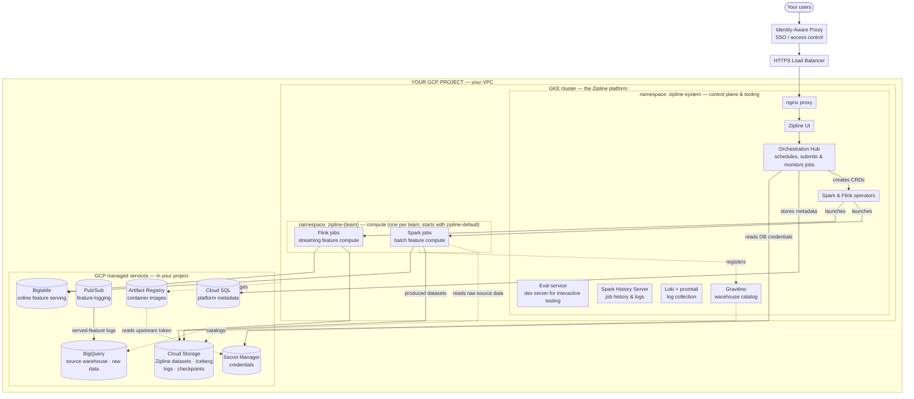

# Working with Zipline: GCP Deployment

This document describes how **Zipline Enterprise** deploys on **Google Cloud (GCP)**. As with
every Zipline engagement, the deployment is **BYOC (Bring Your Own Cloud)** — the Zipline control
plane and all compute run inside *your own* GCP project and VPC, complementing the open-source
Chronon engine. Your data never leaves your environment.

Access from your users is fronted by an **Identity-Aware Proxy (IAP)**, so only people you
authorize can reach the Hub UI.

## Infrastructure footprint

At a high level, a Zipline deployment on GCP is **Zipline Hub**, **Spark/Flink** compute, a
**KV Store** for online serving, and a **warehouse** for feature datasets — all running in your
GCP project. Source (raw) data is read from your **BigQuery** warehouse; Zipline-produced
datasets are written as **Iceberg tables on Cloud Storage** and registered in Zipline's own
**warehouse catalog (Gravitino)**. Concretely, these map to:

| Zipline component | Runs on / uses (GCP) |
|---|---|
| Zipline Hub, UI, Eval, warehouse catalog (Gravitino) | GKE — `zipline-system` namespace |
| Spark (batch) & Flink (streaming) compute | GKE — `zipline-<team>` namespaces |
| KV Store (online feature serving) | Bigtable |
| Source warehouse (customer raw business data) | BigQuery |
| Zipline-produced datasets (Iceberg) | Cloud Storage, cataloged by Gravitino |
| Platform metadata | Cloud SQL |
| Feature-logging pipeline | Pub/Sub → BigQuery |
| Container images | Artifact Registry |
| Credentials | Secret Manager |

## Deployment

**Notes on Zipline GCP deployment:**

- **Everything runs in your project.** The Zipline control plane and all compute deploy into
  your GCP project on a private VPC; your data stays in your environment.
- **Hub + UI and Spark/Flink compute all run on GKE**, split into a shared control-plane
  namespace (`zipline-system`) and one compute namespace per team (`zipline-<team>`).
- **Data flow:** Spark reads your raw source data from **BigQuery**; Zipline-produced datasets
  are written as **Iceberg tables on Cloud Storage** and registered in Zipline's own warehouse
  catalog (**Gravitino**); features for online serving are written to **Bigtable**.
- **Zipline → Chronon communication:** the Hub submits scripts to the Chronon engine using the
  open-source API to run batch and streaming jobs.
- **Jobs are triggered in one of two ways:** ad-hoc submission from a user's laptop via the
  Zipline CLI, or scheduled based on configs in the repository.
- **No static keys.** In-cluster workloads access GCP services via **Workload Identity** —
  access is granted through GCP service accounts, with no long-lived keys to manage.

## What runs in the GKE cluster

The Zipline application and all compute run as Kubernetes workloads. Namespaces are flat: one
shared **control-plane** namespace (`zipline-system`) plus one **compute namespace per team**
(starting with `zipline-default`).

### `zipline-system` — control plane & tooling

| Component | What it does |
|---|---|
| **Zipline UI** | The web interface your team uses to define and monitor features. |
| **Orchestration Hub** | Schedules feature pipelines, submits and monitors Spark/Flink jobs, proxies the Spark/Flink/History UIs, tracks job history, and drives the UI. |
| **Eval** | Dev server for interactive testing — quickly validate a job's semantics as you author it. |
| **Spark History Server** | Post-run Spark UI — inspect completed jobs, stages, and logs. |
| **Loki + promtail** | Collects and stores job and platform logs inside the cluster. |
| **Spark & Flink operators** | Turn job submissions into running Spark/Flink pods. |
| **Gravitino** | Zipline's warehouse catalog — registers Zipline-produced Iceberg datasets stored on Cloud Storage. |

The UI and Hub sit behind a single **nginx proxy**, so there's one entry point for the platform.

### `zipline-<team>` — compute (one per team)

| Component | What it does |
|---|---|
| **Spark jobs** | Batch feature computation (driver + autoscaling executors). |
| **Flink jobs** | Streaming feature computation (JobManager + TaskManagers). |

Compute scales elastically — you don't size clusters or pick machine types. Jobs scale up on
demand and release nodes when idle, using spot/preemptible capacity where appropriate.

## Multi-team isolation

Compute namespaces map to your **team-level configurations**: the install starts with
`zipline-default`, and additional per-team namespaces (`zipline-<team>`) are added as teams are
defined. Each namespace has its own **resource quotas**, giving every team an isolated compute
boundary.

## GCP managed services Zipline uses

All of these live in **your** project. Zipline accesses them using **Workload Identity** — pods
are granted access through GCP service accounts, so there are **no static keys** to manage.

| Service | What Zipline uses it for |
|---|---|
| **Cloud Storage (GCS)** | Stores Zipline-produced datasets (Iceberg tables, cataloged by Gravitino), plus Spark event logs, Flink checkpoints, and artifacts. |
| **BigQuery** | Your **source warehouse** — Spark reads the customer's native raw business data from here. Also the destination for logged features. |
| **Bigtable** | Low-latency online store (KV Store) for serving features to your applications. |
| **Pub/Sub** | Streams logged feature-serving responses into BigQuery. |
| **Cloud SQL** | Stores platform metadata (the Hub's job index). The Hub reads its DB credentials from Secret Manager. |
| **Artifact Registry** | Hosts the platform's container images. Mirrors upstream images using a token stored in Secret Manager. |
| **Secret Manager** | Holds credentials — the Cloud SQL password and the image-mirror token. |

## Network & security

- **Everything runs in your VPC.** The platform deploys into your GCP project on a private
  VPC and subnet. Your data stays in your project.
- **Private connectivity.** Cloud SQL and Bigtable are reached over **Private Services Access**
  (private IPs), not the public internet.
- **Egress only.** Outbound traffic (e.g., pulling container images) goes through **Cloud NAT**;
  there are no public ingress paths to your data services.
- **Authenticated access.** Your users reach the UI through an **Identity-Aware Proxy**, so
  access is gated by your Google identity / group membership.
- **No static keys.** In-cluster workloads authenticate to GCP services via **Workload
  Identity**, eliminating long-lived service-account keys.
